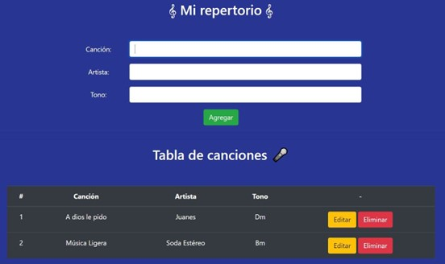

## Desafío - Mi repertorio

- Para realizar este desafío debes haber estudiado previamente todo el material disponible correspondiente a la unidad.
- Una vez terminado el desafío, comprime la carpeta que contiene el desarrollo de los requerimientos solicitados y sube el .zip en el LMS.
- Puntaje total: 10 puntos

### Desarrollo desafío:

- El desafío se debe desarrollar de manera Grupal.
- Para la realización del desafío necesitarás apoyarte del archivo Apoyo Desafío - Mi Repertorio.

#### Descripción

La escuela de música "E-Sueño" está motivando a sus estudiantes de canto a presentarse en vivo y se puso en contacto con el restaurante del sector para utilizar su tarima e iniciar un calendario de presentaciones. Para conocer y gestionar las canciones que cantarán sus estudiantes, la escuela contrató a un desarrollador freelance para la creación de una aplicación tipo CRUD.

En este desafío deberás desarrollar un servidor con Express que utilice el módulo File System para agregar, modificar y eliminar canciones almacenadas en un JSON local llamado repertorio.json.

El servidor deberá disponibilizar las siguientes rutas:

- `POST /canciones` : Recibe los datos correspondientes a una canción y la agrega al repertorio.
- `GET /canciones` : Devuelve un JSON con las canciones registradas en el repertorio
- `PUT /canciones/:id` : Recibe los datos de una canción que se desea editar y la actualiza manipulando el JSON local.
- `DELETE /canciones/:id` : Recibe por queryString el id de una canción y la elimina del repertorio.

Tienes a disposición un Apoyo Desafío - Mi Repertorio con la aplicación cliente que se muestra en la siguiente imagen, lista para el consumo de estas rutas, por lo que deberás enfocarte solo en el desarrollo backend.

Si quieres seguir practicando la creación de aplicaciones con Express, te sugerimos rehacer el desafío anterior, pero ahora como un servidor que sirva 2 rutas para registrar y leer las citas de la Veterinaria Js.

#### Requerimientos

1. Levantar un servidor local usando Express Js (2 Puntos)
2. Devolver una página web como respuesta a una consulta GET (2 Puntos)
3. Ofrecer diferentes rutas con diferentes métodos HTTP que permitan las operaciones CRUD de datos alojados en un archivo JSON local (3 Puntos)
4. Manipular los parámetros obtenidos en la URL (1 Puntos)
5. Manipular el payload de una consulta HTTP al servidor (2 Puntos)

¡Mucho éxito!
